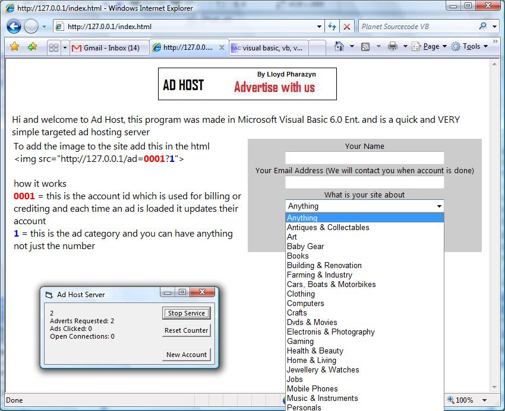



## Ad Host \- Be your own Google Ads \(a targeted ad/website server\)

### Description

This is a advertising server used for hosting banner ads and keeping accounts for billing or crediting Account owners, when an ad is called from a site this program reads the link and sends back the appropriate banner advert and also updates the related billing info for the owner and hoster of the respected advert. the banner link html will look similar to this img src="http://127.0.0.1/ad=0001?1", this is all the browser sees, this server also has form posting built in and a sample webpage so that people can goto your internet address and this program also acts as a webserver and it will send them the sample introduction page and a signup from, when the users signup this server creates a temp account in a pending folder with all the nessercary details needed for you to create an account for them.
 
### More Info
 

             |
---                |---
**Submitted On**   |2007-07-12 06:00:02
**By**             |[Lloyd Pharazyn](https://github.com/Planet-Source-Code/PSCIndex/blob/master/ByAuthor/lloyd-pharazyn.md)
**Level**          |Beginner
**User Rating**    |5.0 (10 globes from 2 users)
**Compatibility**  |VB 5\.0, VB 6\.0
**Category**       |[Internet/ HTML](https://github.com/Planet-Source-Code/PSCIndex/blob/master/ByCategory/internet-html__1-34.md)
**World**          |[Visual Basic](https://github.com/Planet-Source-Code/PSCIndex/blob/master/ByWorld/visual-basic.md)
**Archive File**   |[Ad\_Host\_\-\_2075057122007\.zip](https://github.com/Planet-Source-Code/lloyd-pharazyn-ad-host-be-your-own-google-ads-a-targeted-ad-website-server__1-68984/archive/master.zip)

